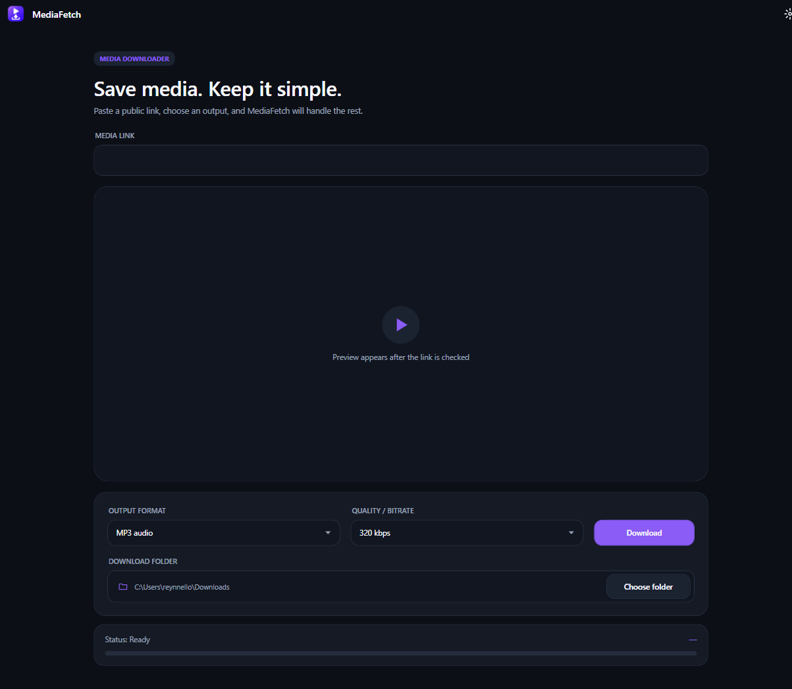

# MediaFetch

MediaFetch is a Windows desktop application for inspecting and downloading
public video or audio through a simple WPF interface.




## Features

- Automatically inspects a public media link and displays its source,
  thumbnail, title, author, duration, and available qualities.
- Downloads MP4, MKV, WebM, and MOV video.
- Extracts original audio or converts it to MP3, M4A, Opus, FLAC, or WAV.
- Embeds album cover art and track metadata (title, artist, album) into
  downloaded audio files when the format supports it.
- Shows real download progress and approximate output sizes.
- Supports cancellation and removes unfinished temporary files.
- Opens a completed file or reveals it in File Explorer.
- Includes light and dark themes and remembers user settings.
- Supports YouTube as the primary source and other public links supported by
  yt-dlp on a best-effort basis.

MediaFetch does not bypass DRM, authentication, paywalls, or other technical
protections. Only download media you have permission to save.

## Download and run

Two Windows x64 editions are available. The **portable** edition is the easiest
one to use. The **standard** edition makes the application download much
smaller, but requires the .NET Desktop Runtime and media tools.

### Portable edition

Download `MediaFetch-1.0.1-win-x64-portable.zip` from GitHub Releases if you
want one package with everything included.

1. Extract the entire archive. Do not run the application from inside the ZIP.
2. Keep the included `tools` folder next to `MediaFetch.exe`.
3. Launch `MediaFetch.exe`.

No .NET, yt-dlp, FFmpeg, FFprobe, or Python installation is required.

### Standard edition (small application download)

Download both of these files from the same GitHub Release:

- `MediaFetch-1.0.1-win-x64-standard.zip`
- `MediaFetch-1.0.1-win-x64-dependencies.zip`

Then:

1. Extract **both archives into the same folder**. The resulting folder must
   contain `MediaFetch.exe`, a `tools` folder, and a `dotnet` folder.
2. Open the `dotnet` folder and run the included .NET 10 Windows Desktop Runtime
   installer. This is required only once per computer.
3. Launch `MediaFetch.exe`.

The standard executable is framework-dependent, which is why it is only a few
megabytes. The separate dependencies archive contains the official .NET 10
Windows Desktop Runtime installer, yt-dlp, FFmpeg, and FFprobe. The installer
may be deleted after .NET is installed, but the `tools` folder must stay next to
`MediaFetch.exe`.

If the .NET 10 Windows Desktop Runtime and all three command-line tools are
already installed and available through `PATH`, only the standard archive is
needed.

### System requirements

- A supported 64-bit edition of Windows 10 or Windows 11.
- An internet connection.
- Write access to the selected download folder.

Windows SmartScreen may warn about an unrecognized application because the
release is not digitally code-signed.

## Development

Prerequisites:

- .NET 10 SDK.
- Current `yt-dlp`, `ffmpeg`, and `ffprobe` executables available through PATH.

Run the application:

```powershell
dotnet run
```

Create a portable Windows x64 package:

```powershell
.\scripts\Publish-Release.ps1 -Version 1.0.1
```

Create the small standard package and its separate dependencies package:

```powershell
.\scripts\Publish-StandardRelease.ps1 -Version 1.0.1
```

The archives are written to `artifacts/`. The publish scripts copy the locally
installed command-line tools into the relevant package; their versions
therefore match the build machine. The standard release script downloads the
latest .NET 10 Windows Desktop Runtime installer from Microsoft's official
release metadata and verifies its SHA512 checksum before packaging it.

## Technology

- C# 14 and .NET 10
- WPF
- yt-dlp
- FFmpeg and FFprobe

Third-party licensing information is available in
[THIRD-PARTY-NOTICES.md](THIRD-PARTY-NOTICES.md).
